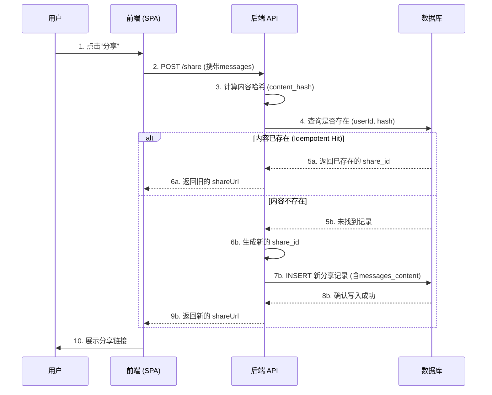
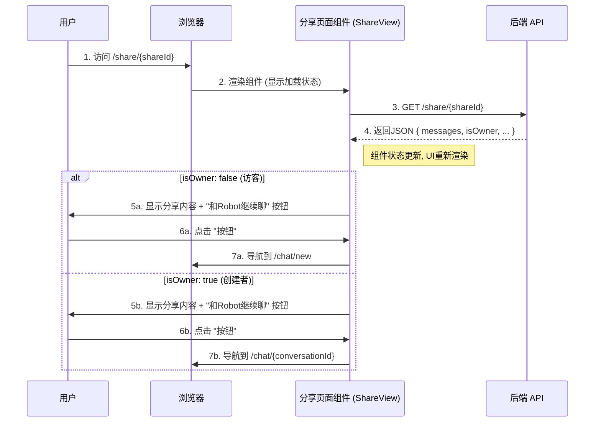

### 文档一：功能设计文档

#### **1. 功能概述 (Feature Overview)**

本功能允许用户将一段特定的 AI 对话生成一个唯一的、可公开访问的链接，以便分享给他人。访问者（包括分享创建者本人）将首先看到一个统一的、只读的分享预览页面。页面上会根据访问者的身份（是否为创建者）会话逻辑，引导用户进行下一步操作。

#### **2. 设计原则与目标 (Guiding Principles & Goals)**

*   **YAGNI (You Ain't Gonna Need It):** 保持初始版本简洁。功能如“浏览量统计”等非核心需求，在明确需要前暂不实现。
*   **统一体验入口 (Unified Entry Point):** 所有用户通过分享链接访问时，首先看到的都是相同的分享预览页面，确保体验的一致性。
*   **内容即入口 (Content as a Hook):** 将分享内容作为吸引新用户或引导老用户回流的核心。
*   **性能与可扩展性 (Performance & Scalability):** 后端设计应保证分享链接的创建和访问是高效的，且未来易于扩展。

#### **3. 核心工作流程 (Core Workflows)**

##### **3.1. 创建分享流程 (Create Share Flow)**

**简短描述**  

用户发起分享请求后，后端首先对分享内容计算哈希值以实现幂等性判断。如果相同内容已存在，则直接返回旧链接；否则，将分享元数据和完整的消息内容作为一个整体写入数据库新纪录，并返回新链接。

**时序图**


---

##### **3.2. 访问分享：统一预览，差异化跳转**

**简短描述**  

无论谁访问分享链接，都会**首先看到同样的内容预览页面**。页面加载后，系统会根据访问者是否为创建者，按钮点击后，会跳转至不同的会话创建逻辑。

**时序图：访问分享**




#### **4. 数据库设计**

- 表名: shared_conversations

| 字段名 (Field Name) | 类型 (Type) | 约束 (Constraints) | 描述 (Description) |
| :--- | :--- | :--- | :--- |
| `id` | `BIGINT UNSIGNED` | PK, AI | 主键，自增ID。 |
| `share_id` | `VARCHAR(20)` | NOT NULL, UNIQUE | **业务主键**，对外暴露的短ID，需要建索引。 |
| `original_conversation_id` | `VARCHAR(255)` | NOT NULL | 原始对话ID，用于创建者回流。 |
| `created_by_id` | `BIGINT UNSIGNED` | NOT NULL, FK(`users.id`) | 创建者用户ID。 |
| `content_hash` | `VARCHAR(64)` | NOT NULL | **幂等性关键字段**。消息内容的SHA-256哈希。 |
| `messages_content` | `JSON` | NOT NULL | **核心数据字段**。存储分享的完整消息对象数组。 |
| `expires_at` | `DATETIME` | NULL | 过期时间，`NULL` 表示永不过期。 |
| `is_deleted` | `TINYINT(1)` | NOT NULL, DEFAULT 0 | 软删除标志。 |
| `created_at` | `DATETIME` | NOT NULL, DEFAULT NOW() | 记录创建时间。 |
| `updated_at` | `DATETIME` | NOT NULL, ON UPDATE NOW() | 记录最后更新时间。 |

- 索引建议 (Indexing Recommendations):
  - share_id 字段上创建唯一索引。
  - 在 (created_by_id, content_hash) 上创建联合索引以优化幂等性检查。


---

## 文档二：接口设计文档

### **1. 通用约定**

*   **Base URL**: `/api/v1/robot/conversations`
*   **Resource Path**: `/share`
*   **认证 (Authentication):** 所有需要认证的接口，均需在请求头中提供 `Authorization: Bearer <YOUR_JWT_TOKEN>`。
*   **日期格式 (Date Format):** 所有日期时间字符串均采用 ISO 8601 UTC 格式 (例如: `2025-11-03T14:20:05Z`)。
*   **响应体 (Response Bodies):** 成功与错误的响应体结构在所有接口中保持一致性。

---

### **2. 接口列表 (API Endpoints)**

#### **2.1 创建分享 (Create Share)**

*   **Endpoint**: `POST /share`
*   **描述**: 创建一个新的会话分享。此接口具备**幂等性**：如果使用同一个 `originalConversationId` 多次调用，只有第一次会创建新的分享，后续调用将直接返回已创建的分享信息。
*   **认证**: **必须 (Required)**

##### **请求参数 (Request Parameters)**
*   **Content-Type**: `application/json`

| 字段名 (Field) | 类型 (Type) | 是否必须 (Required) | 描述 (Description) |
| :--- | :--- | :--- | :--- |
| `messages` | `Array<Object>` | Yes | 会话消息内容的完整数组。 |
| `originalConversationId` | `String` | Yes | 原始会话的唯一ID，用于实现幂等性。 |
| `expiresAt` | `String \| null` | No | 分享的过期时间 (ISO 8601 格式)。<br>**默认行为**: 若不提供或为 `null`，则自动设置为24小时后过期。 |

*   **`messages` 对象结构**:
    *   `isUser` (`Boolean`): `true` 为用户消息, `false` 为 AI 回复。
    *   `content` (`String`): 消息文本内容。

##### **响应 (Responses)**

*   **✅ 成功响应 (200 OK)**
    *   **Body**:
        ```json
        {
          "shareId": "aB3cD_eF5gH6",
          "shareUrl": "https://xxx.com/api/v1/robot/conversations/aB3cD_eF5gH6",
          "expiresAt": "2025-01-01T00:00:00Z"
        }
        ```
*   **❌ 错误响应 (Error Responses)**
    *   `400 Bad Request`: 查询参数 page 或 pageSize 无效。
    *   `401 Unauthorized`: 用户未登录或 Token 无效。
---

#### **2.2 获取分享数据 (Get Share Data)**

*   **Endpoint**: `GET /share/:shareId`
*   **描述**: 获取指定分享的详细内容，并提供所有权信息以供前端进行路由决策。
*   **认证**: **可选 (Optional)**

##### **请求参数 (Request Parameters)**

| 参数名 (Parameter) | 位置 (In) | 类型 (Type) | 是否必须 (Required) | 描述 (Description) |
| :--- | :--- | :--- | :--- | :--- |
| `shareId` | Path | `String` | Yes | 要获取的分享记录的唯一 ID。 |

##### **响应 (Responses)**

*   **✅ 成功响应 (200 OK)**
    *   **Body**:
        ```json
        {
          "shareId": "aB3cD_eF5gH6",
          "messages": [
            { "isUser": true, "content": "你好，什么是RESTful API？" },
            { "isUser": false, "content": "RESTful API是一种..." }
          ],
          "createdAt": "2025-11-03T14:20:05Z",
          "expiresAt": "2025-11-04T14:20:05Z",
          "isOwner": true,
          "originalConversationId": "conv_7a8b9c0d1e2f3a4b"
        }
        ```
    *   **字段说明**:
        *   `isOwner` (`Boolean`): `true` 表示当前访问者是创建者。
        *   `originalConversationId` (`String | null`): 仅在 `isOwner` 为 `true` 时返回。

*   **❌ 错误响应 (Error Responses)**
    *   `404 Not Found`: 指定的 `shareId` 不存在。
    *   `410 Gone`: 分享存在但已过期。

---

#### **2.3 获取我的分享列表 (Get My Share List)**

*   **Endpoint**: `GET /share/my`
*   **描述**: 分页获取当前登录用户创建的所有分享记录。
*   **认证**: **必须 (Required)**

##### **请求参数 (Request Parameters)**

| 参数名 (Parameter) | 位置 (In) | 类型 (Type) | 是否必须 (Required) | 默认值 (Default) | 描述 (Description) |
| :--- | :--- | :--- | :--- | :--- | :--- |
| `page` | Query | `Integer` | No | `1` | 请求的页码。 |
| `pageSize` | Query | `Integer` | No | `20` | 每页数量。 |

##### **响应 (Responses)**

*   **✅ 成功响应 (200 OK)**
    *   **Body**:
        ```json
        {
          "data": [
            {
              "shareId": "hnF8a2kQ",
              "title": "什么是RESTful API？",
              "createdAt": "2025-11-03T14:20:05Z",
              "expiresAt": "2025-11-04T14:20:05Z"
            }
          ],
          "pagination": { "totalItems": 1, "currentPage": 1, "pageSize": 20, "totalPages": 1 }
        }
        ```

*   **❌ 错误响应 (Error Responses)**
    *   `400 Bad Request`: 查询参数无效。
    *   `401 Unauthorized`: 未认证。

---

#### **2.4 更新分享 (Update Share)**

*   **Endpoint**: `PATCH /share/:shareId`
*   **描述**: 更新一个已存在分享的属性，例如延长其有效期。仅限创建者操作。
*   **认证**: **必须 (Required)**

##### **请求参数 (Request Parameters)**

| 参数名 (Parameter) | 位置 (In) | 类型 (Type) | 是否必须 (Required) | 描述 (Description) |
| :--- | :--- | :--- | :--- | :--- |
| `shareId` | Path | `String` | Yes | 要更新的分享记录的唯一 ID。 |

##### **请求体 (Request Body)**
*   **Body**:
    ```json
    {
      "expiresAt": "2026-01-01T00:00:00Z"
    }
    ```

##### **响应 (Responses)**

*   **✅ 成功响应 (200 OK)**
    *   **Body**: 返回更新后的完整分享对象。
        ```json
        {
          "shareId": "hnF8a2kQ",
          "title": "什么是RESTful API？",
          "createdAt": "2025-11-03T14:20:05Z",
          "expiresAt": "2026-01-01T00:00:00Z"
        }
        ```

*   **❌ 错误响应 (Error Responses)**
    *   `400 Bad Request`: 请求体无效。
    *   `401 Unauthorized`: 未认证。
    *   `403 Forbidden`: 无权操作。
    *   `404 Not Found`: 分享不存在。

---

#### **2.5 删除分享 (Delete Share)**

*   **Endpoint**: `DELETE /share/:shareId`
*   **描述**: 软删除一个由当前用户创建的分享。仅限创建者操作。
*   **认证**: **必须 (Required)**

##### **请求参数 (Request Parameters)**

| 参数名 (Parameter) | 位置 (In) | 类型 (Type) | 是否必须 (Required) | 描述 (Description) |
| :--- | :--- | :--- | :--- | :--- |
| `shareId` | Path | `String` | Yes | 要删除的分享记录的唯一 ID。 |

##### **响应 (Responses)**

*   **✅ 成功响应 (204 No Content)**
    *   请求成功，资源已删除，响应体为空。

*   **❌ 错误响应 (Error Responses)**
    *   `401 Unauthorized`: 未认证。
    *   `403 Forbidden`: 无权操作。
    *   `404 Not Found`: 分享不存在。
